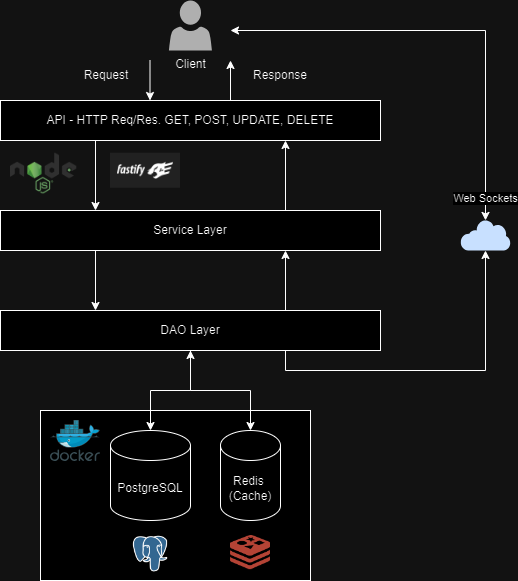

# Polls Backend

This is a simple backend application built with Node.js and Fastify that allows users to create, view, and vote on polls. It utilizes TypeScript for type safety, Fastify as the web framework, Prisma ORM for database interaction with PostgreSQL and Redis services managed via Docker, Zod for data validation, and WebSocket for real-time communication.

## Diagram



## Features

- Create a new poll with multiple options.
- View existing polls and their options.
- Vote on a poll option.
- Unique user identification using UUID to prevent multiple votes.

## Technologies Used

- Node.js
- Fastify
- TypeScript
- Prisma ORM
- Docker
- PostgreSQL
- Redis
- Zod
- WebSocket

## Installation

1. Clone the repository:

```bash
git clone https://github.com/duardoliveiras/polls-backend.git
```

2. Navigate to the project directory:

```bash
cd project-directory
```

3. Install dependencies:

```bash
npm install
```

4. Set up environment variables (if needed).

5. Start the application:

```bash
npm start
```

## Usage

1. Create a new poll:
   - Endpoint: `/polls`
   - Method: `POST`
   - Example: `http://localhost:3000/polls`
   - Request body should contain poll question and options.
   ```
    {
        "title":"Question?",
        "options": ["option1", "option2"]
    }   
   ```

2. View one poll:
   - Endpoint: `/poll/:id`
   - Example: `http://localhost:3000/poll/:id`
   - Method: `GET`

3. Vote on a poll:
   - Endpoint: `/polls/:id/vote`
   - Method: `POST`
   - Example: `http://localhost:3000/poll/:id/vote`
   - Request body should contain the option ID to vote on.
   ```
    {
        "pollOptionId" : "b52367ad-721f-42df-86fb-5a7ffea5563e"
    }
   ```
4. Web Socket on poll votation:
   - Endpoint: `/poll/:id/result`
   - Example: `ws://localhost:3000/poll/:id/results`
   - Every time that ocurr a vote on a poll, the result will be sent to the client.
   ```
    {
       "pollOptionId": "37631074-73dd-4910-be87-d75d2739362a",
       "votes": 2
    }
   ```